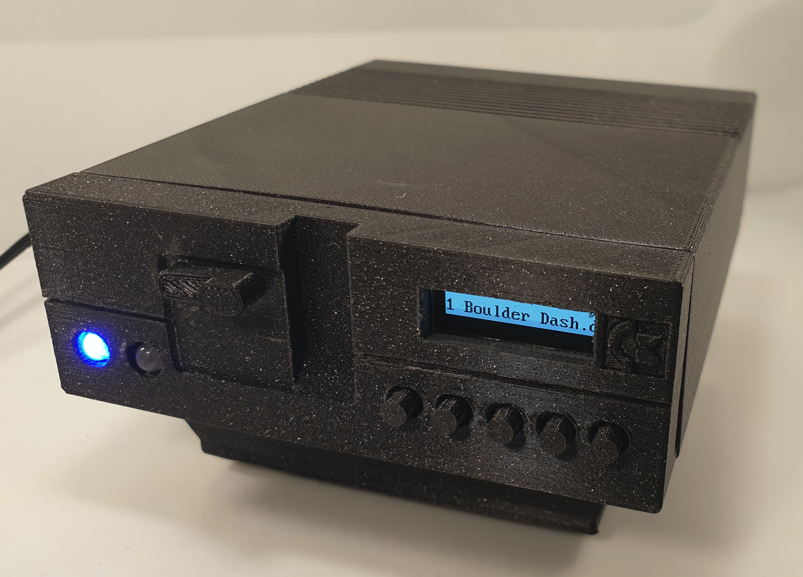
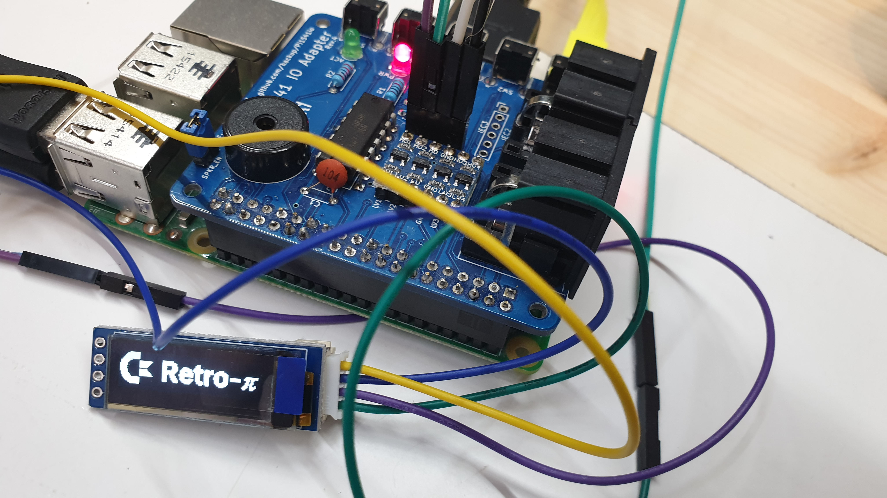

# JCR-1541-II-1 - A Hybrid Disk Drive and C64 Emulator in Commodore 1541-II Form Factor

**Features:**

- Cycle exact Commodore 1541 disk drive emulator (via [Pi1541](https://cbm-pi1541.firebaseapp.com/))
- Can also be used as a C64 Emulator (via [RetroPie](https://retropie.org.uk/))
- Supports serial bus chaining for connecting with other emulators or physical devices
- Power and activity leds
- Disk loading sounds
- Buttons and LED screen for changing loaded disk image
- External USB ports for easy connectivity (COMING SOON!)

See the table below for feature comparison between Pi1541 and C64 emulator modes.

| Feature              | Pi1541 Mode        | C64 Emulator Mode  |
|----------------------|--------------------|--------------------|
| Power led            | supported          | supported          |
| Activity led         | supported          | not supported      |
| Disk loading sounds  | supported          | not supported      |
| LED screen           | supported          | supported          |
| Front panel buttons  | supported          | not supported      |
| Disk images via USB  | supported          | not supported      |
| HDMI output          | supported          | supported          |
| USB joysticks        | -                  | supported          |
| Bluetooth joysticks  | -                  | supported          |

## How to Do It Yourself

### Building PI1541 Hat

Obtain necessary materials and build a PI1541 Hat:

- Order PCB: [Pi1541 IO Adapter Rev. 4](https://www.pcbway.com/project/shareproject/Pi1541_IO_Adapter__Rev_4.html)
- Gather required components
  - Most components documented at: https://www.hackup.net/2018/07/pi1541io-revision-4/
  - Exception: get SSD1306 OLED 128x32 instead of 128x64!

Solder components and necessary headers:

- For pinout compatibility, solder LED screen to use **bus 1**

### Printing the Case

TODO

### Software Setup: PI1541

TODO

### Optional: Adding RetroPie Support

#### Install RetroPie

Obtain SD card and flash it with [RetroPie (v4.0.2 or later)](https://retropie.org.uk/)

#### Configure OLED Display Support

For hardware pinout compatibility, make sure your PI1541 Hat is configured to use bus 1 (see table above).

| pin             | PI1541 Hat (Bus 0) | PI1541 Hat (Bus 1) | RetroPie OLED |
|-----------------|--------------------|--------------------|---------------|
| GND             | (any gnd pin)      | (any gnd pin)      | pin 6         |
| 5V              | (any 5V pin)       | (any 5V pin)       | pin 4         |
| SDA             | pin 27             | pin 3              | pin 3         |
| SDL             | pin 28             | pin 5              | pin 5         |

#### Install C64 Emulator (Vice)

- Navigate to RetroPie Setup
- From optional packages, choose and install VICE

##### Using SSD1306 OLED 128x32

Install and configure RetroPie OLED version that has been specially adjusted for this use:

    sudo apt-get update
    cd /home/pi
    git clone https://github.com/jsalonen/RetroPie-OLED.git
    cd RetroPie-OLED
    chmod 755 11.OLED.sh
    sudo ./11.OLED.sh

End result should look like this:

## License and Credits

**This project is provided "as is", without warranty of any kind.**

The project includes adaptations of licensed works as follows:

- Case is adapted from [Pi1541-II Case](https://www.thingiverse.com/thing:3127040), by [chrisjh](https://www.thingiverse.com/chrisjh). Licensed under [Creative Commons - Attribution](https://creativecommons.org/licenses/by/3.0/).
- RetroPie OLED library is based on [RetroPie-OLED](https://github.com/losernator/RetroPie-OLED) by Duritz, losernator, RiNa, Yanubis, 까먹구, et al. Licensed under GNU General Public License v3.0.
